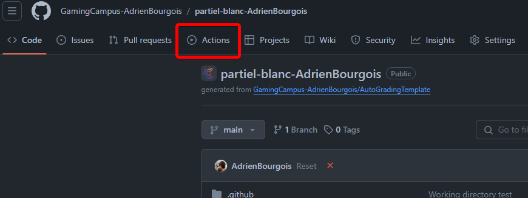
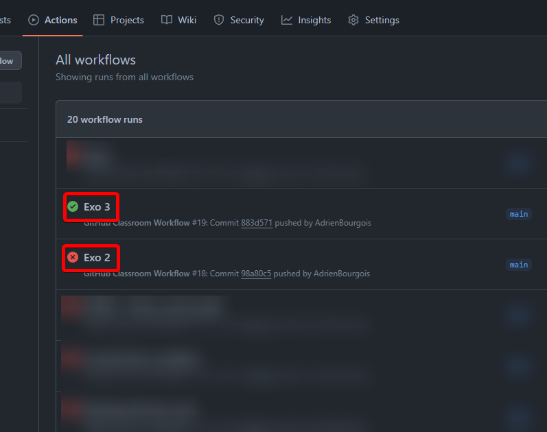
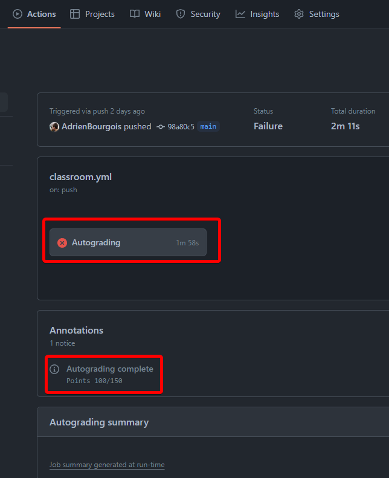
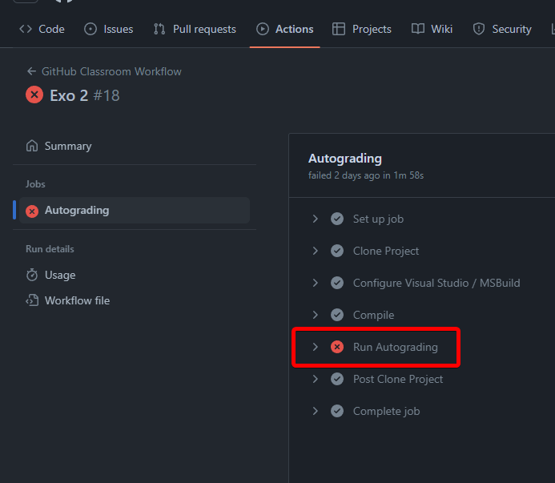

# Test d'admission C++

Bienvenue dans votre test d'admission pour le GamingCampus ! Ce test est conçu pour évaluer vos compétences en programmation C++ et votre capacité à résoudre des problèmes. Ce document contient toutes les instructions nécessaires pour compléter votre test.

---

## **Structure du Projet**

Le projet est une solution Visual Studio 2022. Il est organisé de manière à faciliter le développement et l'évaluation de vos exercices. Voici la structure du projet :
- **Fichier de solution** : `CodeEval.sln`
- **Projet principal** : `Exercises.vcxproj`
- **Dossier des exercices** : `Exercises/`
  - Contient les fichiers où vous implémenterez vos solutions. Ce partiel contient les exercices "SmartPointer" et "GameObject"
- **Fichier `main.cpp`** : Vous êtes entièrement libre de le modifier. Il n'est pas utilisé pour l'évaluation automatique, mais il peut être utile pour tester vos solutions localement. Voyez-le comme un bac à sable pour vos tests, ou votre brouillon.
- **Dossier Autograder** : `Autograder/`
  - Ce dossier contient les fichiers nécessaires à l'évaluation automatique. Vous ne devriez pas le modifier. Si une modification involontaire a lieu (par exemple via un outil d'auto-formatage), elle sera vérifiée sans pénalité. Toute modification intentionnelle en vue de tricher sera sanctionnée.
- **Langage utilisé** : Ce projet utilise le standard **C++20**.

Pour ce projet, 4 exercices sont à réaliser. Réalisez en le plus possible, mais ne vous inquiétez pas si vous n'avez pas le temps de finir tous les exercices. Vous serez noté(e) sur la qualité de votre code et votre capacité à résoudre des problèmes.
La correction automatique est basée sur des tests unitaires, et vous permettra de voir vos résultats en temps réel. Mais il est important de noter que la correction automatique ne remplace pas la correction manuelle qui sera effectuée dans un second temps par un membre de l'équipe pédagogique.

### **Exercices** (dans l'ordre de difficulté croissante) :
- **Exercice 1 : BankAccount**
  - Explications dans le fichier `Bank.h`
  - Implémentez une classe `BankAccount` pour gérer un compte bancaire.
  - Gérez les opérations de dépôt, retrait et affichage du solde.
  - Au besoin, pour des rappels, le fichier `TemplateExemples.h` contient des commentaires et des explications sur les concepts à utiliser.
- **Exercice 2 : Library**
   - Explications dans le fichier `Library.h`
   - Implémentez une classe `Library` pour gérer une bibliothèque de livres.
   - Gérez les opérations d'ajout, de suppression et d'affichage des livres.
- **Exercice 3 : SmartPointer**
  - Explications dans le fichier `SmartPointer.h`
  - Implémentez un smart pointer en C++.
  - Utilisez les concepts de RAII et de gestion de la mémoire.
- **Exercice 4 : GameObject**
  - Explications dans le fichier `GameObject.h`
  - Implémentez une classe `GameObject` pour représenter un objet de jeu de façon similaire à Unity;
  - Gérez les attributs et les méthodes associés à un objet de jeu.

---

## **Règles**

1. **Modification des fichiers autorisés** :
   - Vous êtes autorisé(e) à modifier uniquement les fichiers situés dans le dossier `Exercises/` ainsi que le fichier `main.cpp`.
   - Toute modification dans le dossier `Autograder/` sera vérifiée manuellement si nécessaire.

2. **Structure des exercices** :
   - Chaque exercice correspond à une classe dans le dossier `Exercises/`. Un squelette de code est fourni pour chaque exercice.
   - Implémentez votre solution dans les fichiers correspondants.

3. **Compilation** :
   - La solution complète est compilée automatiquement à chaque `push` sur GitHub.

4. **Évaluation automatique** :
   - Après chaque `push`, les tests sont lancés automatiquement via **GitHub Actions**.
   - Vous pouvez consulter les résultats directement sur l'onglet **Actions** de votre dépôt GitHub.

5. **Gestion des erreurs de compilation** :
   - Si votre projet ne compile pas, une note de **0 point** sera attribuée par l'autograder. Cependant, chaque exercice sera vérifié manuellement afin d'attribuer les points mérités. Ne paniquez pas si cela vous arrive.

6. **Commentaires et remarques** :
   - Si vous souhaitez transmettre un message ou des remarques à propos de votre code, créez un fichier `Remarques.md` à la racine du projet.

---

## **Processus de Soumission**

1. **Clonez le projet** :
   - Vous pouvez utiliser la ligne de commande :
     ```bash
     git clone <URL-de-votre-depot>
     ```
   - Ou un outil comme Visual Studio, GitHub Desktop, ou tout autre client Git.

2. **Travaillez sur les exercices** :
   - Ouvrez `CodeEval.sln` dans Visual Studio.
   - Implémentez vos solutions dans les fichiers du dossier `Exercises/`.

3. **Testez localement** :
   - Vous pouvez tester votre solution en exécutant le projet dans Visual Studio en modifiant `main.cpp`.
   - Les tests utilisés pour l'évaluation automatique ne sont pas disponibles localement.

4. **Poussez vos modifications** :
   - Une fois satisfait(e) de votre solution, effectuez un commit et un push :
     ```bash
     git add .
     git commit -m "Votre message"
     git push
     ```
   - Vous pouvez pousser autant de fois que nécessaire durant la durée du test.

5. **Consultez les résultats** :
   - Rendez-vous sur l'onglet **Actions** de votre dépôt GitHub pour voir les résultats.

     

   - Chaque test indique sa réussite ou son échec.

     

---

## **Interprétation des Résultats**

- **Succès des tests** :

  

  - Un message indique votre note actuelle, par exemple : `Points 100/150`.

- **Logs détaillés** :

  

  - Les logs contiennent les messages d'erreur et d'autres informations utiles pour déboguer votre code.

---

## **Conseils**

- **Lisez attentivement les consignes** de chaque exercice dans les fichiers du dossier `Exercises/`.
- **Testez régulièrement votre code** avant de le pousser.
- Faites des `push` fréquents pour bénéficier des retours continus de l'évaluation automatique.
- **Utilisez l'outil de votre choix** pour interagir avec Git : ligne de commande, Visual Studio, GitHub Desktop, etc.
- **Modifiez uniquement** les fichiers dans les dossiers autorisés (`Exercises/` et `main.cpp`).

---

Bonne chance ! 🚀
